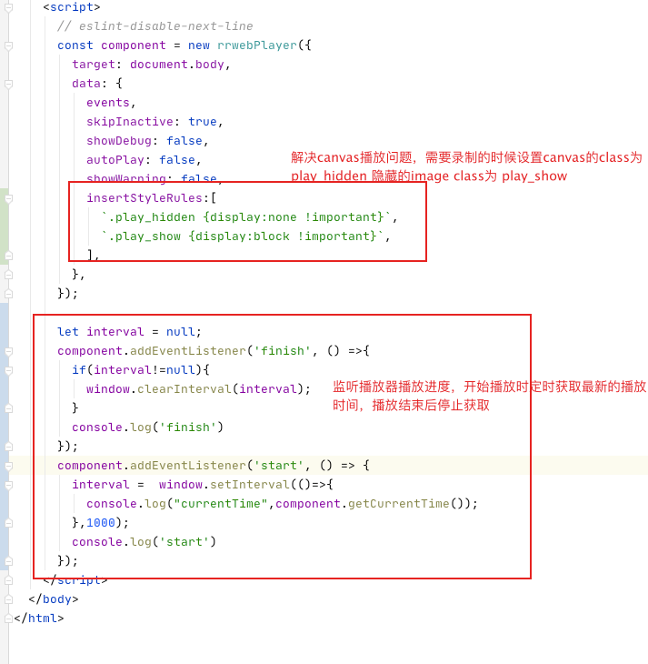

# 使用说明
- `npm install` 安装依赖文件
- `npm run dev` 后修改任何js代码会自动编译
- `npm run build` 构建最终文件，将最终文件copy到项目当中

# 修改部分
- 增加insertStyleRules属性，允许调用方传递该属性
- 增加customSyts属性，允许调方传递该属性，解决insertStyleRules偶尔无效问题
- 增加getCurrentTime()允许调用方获取当前正在播放的时刻
# 注意事项
- 当前工程fork 自https://github.com/rrweb-io/rrweb-player 如果需要同步，可以通过发起pr方式将master分支合并到本参考
- 当前工程引用的rrweb代码是直接采用自己编译过的rrweb-all.js文件，如有rrweb框架改动，也需要重新编译rrweb打包后将rrweb-all.js文件
放到rrweb/目录下
- 通过`npm run build` 构建最终文件(index.js\style.css)，将最终文件copy到action-record工程当中的backend-view/src/components/rrplayer 目录下




*Psst — looking for a shareable component template? Go here --> [sveltejs/component-template](https://github.com/sveltejs/component-template)*

---

# svelte app

This is a project template for [Svelte](https://svelte.technology) apps. It lives at https://github.com/sveltejs/template.

To create a new project based on this template using [degit](https://github.com/Rich-Harris/degit):

```bash
npm install -g degit # you only need to do this once

degit sveltejs/template svelte-app
cd svelte-app
```

*Note that you will need to have [Node.js](https://nodejs.org) installed.*


## Get started

Install the dependencies...

```bash
cd svelte-app
npm install
```

...then start [Rollup](https://rollupjs.org):

```bash
npm run dev
```

Navigate to [localhost:5000](http://localhost:5000). You should see your app running. Edit a component file in `src`, save it, and reload the page to see your changes.


## Deploying to the web

### With [now](https://zeit.co/now)

Install `now` if you haven't already:

```bash
npm install -g now
```

Then, from within your project folder:

```bash
now
```

As an alternative, use the [Now desktop client](https://zeit.co/download) and simply drag the unzipped project folder to the taskbar icon.

### With [surge](https://surge.sh/)

Install `surge` if you haven't already:

```bash
npm install -g surge
```

Then, from within your project folder:

```bash
npm run build
surge public
```
